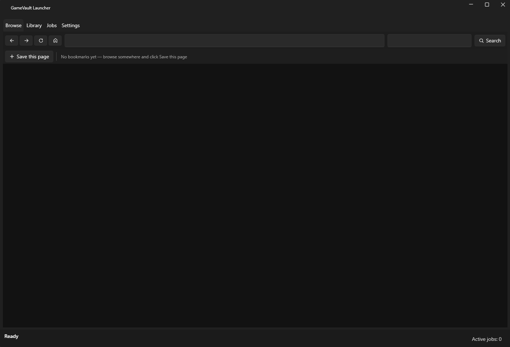

# 7SeasLauncher



A Windows desktop app that puts a browser and a game library in one window. You browse to a game
download page and click the link yourself — 7SeasLauncher catches the download in flight, checks that
the file is a real archive, looks up cover art, unpacks it, finds the executable that launches the
game, and drops it into your library.

It never scrapes sites, never starts downloads on its own, and never touches captchas. You click; it
handles everything after.

## Download

Get the latest build from the [**Releases page**](../../releases/latest). Two builds are published for
every version and they are the same app — pick one:

| File | Size | Needs |
|---|---|---|
| `7SeasLauncher-<version>-win-x64-standalone.zip` | ~67 MB | Nothing but Windows; the .NET runtime is bundled |
| `7SeasLauncher-<version>-win-x64-needs-dotnet8.zip` | ~6 MB | [.NET 8 Desktop Runtime](https://dotnet.microsoft.com/download/dotnet/8.0) |

Unzip it anywhere and run `7SeasLauncher.exe`. There is no installer and no account. Windows
SmartScreen will warn you because the build is unsigned — click **More info → Run anyway**. Both
builds need the Microsoft Edge WebView2 Runtime, which is already present on Windows 11 and most
Windows 10 machines.

Building from source instead? See [Getting started](#getting-started).

## Features

**Browse** — an embedded WebView2 browser with a bookmarks bar. Click **Save this page** on any site
and the app reads its name, address and search box for you. **Home** opens the selected bookmark's
own address; **Search** uses that bookmark's search URL. Links that open a new page get a real window
with its own bookmarks bar, and a download started there keeps running even if you close it.

**Download interception** — downloads are caught through WebView2's download events, not by watching
the Downloads folder. Progress, speed and destination come straight from the running transfer.

**Jobs** — every download becomes a job with a persistent state and a live progress bar: downloading,
verifying, fetching metadata, unpacking, locating the executable. Jobs survive a restart, can be
stopped, and finished ones can be cleared.

**Library** — a cover-art grid backed by SQLite. Rename a game and the metadata lookup runs again;
point a tile at a different executable without leaving the window. Launching is a single click.

**Settings** — folders, SteamGridDB API key, bookmarks, and an antivirus-exclusions helper.

## Built with

| | |
|---|---|
| Runtime | .NET 8, Windows Desktop (WPF) |
| Browser | Microsoft WebView2 |
| UI | WPF-UI (Fluent), CommunityToolkit.Mvvm |
| Data | SQLite via Dapper |
| Archives | SharpCompress |
| HTTP | HttpClient + Polly (retry with backoff) |
| Logging | Serilog |
| Tests | xUnit — **192 tests** |

## Architecture

Three projects, and one rule that keeps them honest: **`SevenSeas.Core` has no reference to WPF or
WebView2.** Everything the app does is testable without a window, and the UI is a thin layer over it.

```text
src/SevenSeas.Core        all logic — no UI dependencies
src/SevenSeas.Launcher    WPF shell, WebView2 host, views and view models
tests/SevenSeas.Tests     xUnit tests for Core
schemes/                  site bookmarks copied next to the executable
```

The pipeline is a set of small services that each do one job:

- `DownloadIntakeService` / `DownloadInterceptor` — turn a caught transfer into a job
- `ArchiveVerifier` — magic-byte check; a bare `.exe` is rejected and trashed
- `MetadataService` — SteamGridDB lookup with best-match selection
- `ArchiveExtractor` — extracts into the game folder, with archive passwords
- `ExtractionNormalizer` — unwraps a redundant wrapper folder and merges a separate Fix/Repair folder
- `ExecutableFinder` — picks the launcher, ranking candidates rather than guessing
- `SqliteGameRepository` — job and game state; SQLite is the source of truth, logs are narrative
- `SpaceCleanupService` / `TrashService` — reclaim disk space, keep a short-lived trash

Jobs are processed one at a time by a single `PipelineWorker`, so extraction never fights itself.

## A download, end to end

1. You click a download link in the Browse tab.
2. WebView2 raises `DownloadStarting`; the app registers a job and lets the transfer run.
3. When it finishes, the archive is verified by magic bytes. Anything that isn't a real archive is
   moved to Trash and the job fails with a readable reason.
4. SteamGridDB supplies a title and cover art (if a key is configured).
5. The archive is unpacked into `Games\{Title}`, then normalised.
6. The launcher executable is chosen and the game appears in the Library.

## Getting started

Requires the **.NET 8 SDK** and, to run the app, the **WebView2 Runtime** (already present on
Windows 11 and most Windows 10 machines).

```powershell
dotnet build 7SeasLauncher.slnx -c Release
dotnet test  tests/SevenSeas.Tests/SevenSeas.Tests.csproj -c Release
dotnet run --project src/SevenSeas.Launcher
```

Metadata lookups need a free [SteamGridDB](https://www.steamgriddb.com/profile/preferences/api) API
key, entered in **Settings → Metadata**. Without one the app falls back to the filename and a
placeholder tile; the pipeline never blocks on metadata.

## Packaging a release

```powershell
# small zip — the user needs the .NET 8 Desktop Runtime
pwsh -File scripts/package-release.ps1 -Version 1.2.0

# standalone zip with .NET bundled — nothing to install
pwsh -File scripts/package-release.ps1 -Version 1.2.0 -SelfContained
```

Both strip symbols and write a `READ-ME-FIRST.txt` covering what the build needs. Neither ever
contains user data: settings (`%APPDATA%\7SeasLauncher`, which holds the API key) are not part of a
published build.

### Publishing a release

Tag a commit and push the tag. `.github/workflows/release.yml` then runs the tests, builds both
zips and attaches them to a GitHub Release:

```powershell
git tag v1.2.0
git push origin v1.2.0
```

The workflow can also be started by hand from the **Actions** tab, where you type the version
number instead of creating a tag.

## Data locations

```text
%APPDATA%\7SeasLauncher\      settings, database, logs
%USERPROFILE%\7SeasLauncher\  Games, Temp, Trash   (all changeable in Settings)
```

## Scope

This is a personal project and a portfolio piece. It does not host, index, or distribute anything —
you point it at sites you have permission to use, and what you download is your responsibility. The
repository ships one fictional example bookmark; any others are added by the user.

## Licence

MIT — see [LICENSE](LICENSE).
